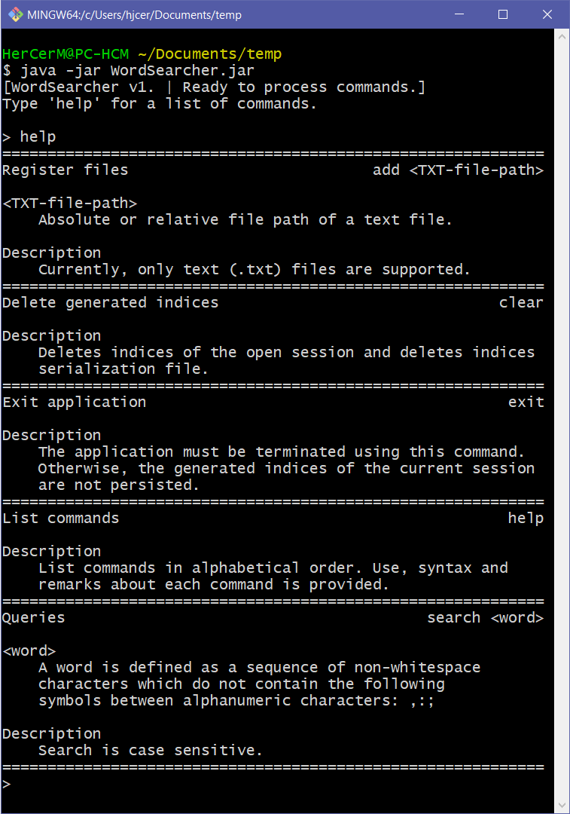
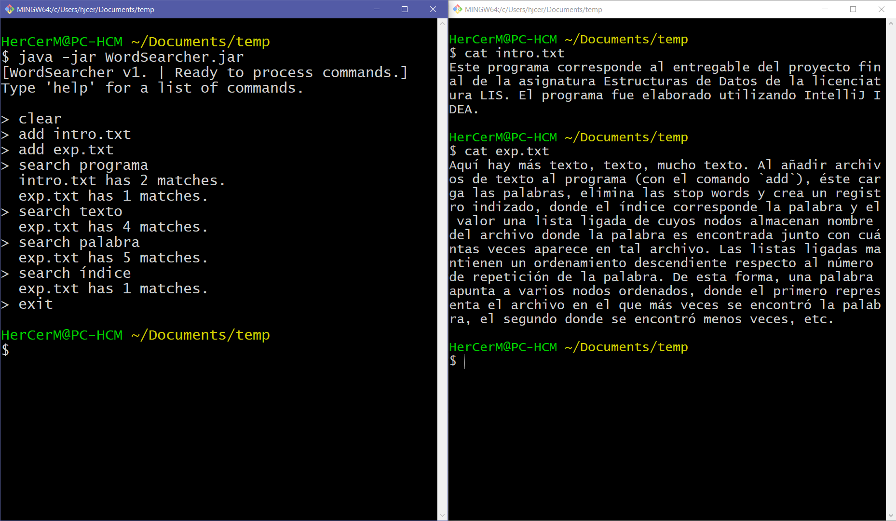

# WordSearcher

> **Only works on Windows** (Windows specific environment variable is accessed.)

Developed as the final project of my 2019 data structures class.

## Assignment goal

The project required building an application that would allow the user to search words existent in text files which would first have to be registered into the application. The application must be able to eliminate stop words (irrelevant search words, such as prepositions or pronouns), persist the generated index and show files that contain the queried word. The files must be shown in some sorted order relevant to the user, for example, number of appearances of the word.

## Implementation overview

For the user interface I opted for a CLI and for persisting the generated index (HashMap Java object) I use serialization. The order of relevant files when a word is queried is done based on the number of matches of the queried word.

The stop words are in Spanish and can be found at <https://raw.githubusercontent.com/stopwords-iso/stopwords-es/master/stopwords-es.txt>. Therefore, the application is intended to be used with text in Spanish.

## Screenshots

### Integrated help system

On each command box, at the top left is a short phrase describing the purpose of the command; at the top right is the syntax in BNF. Each non-terminal symbol is explained and additional remarks of each command are provided under the *Description* title.

    

### Register text files and search words

Notice that when searching the word "programa", the file with the most matches is shown first.

    

